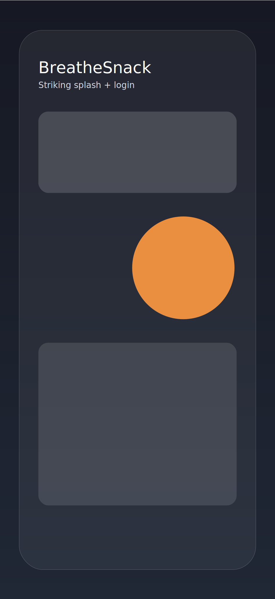
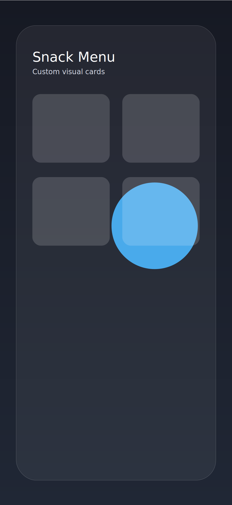
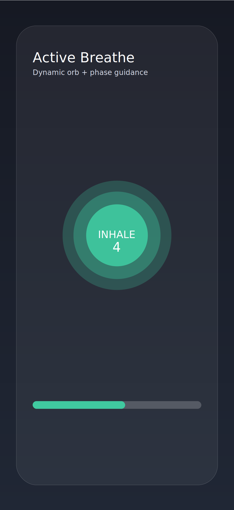

# BreatheSnack

[](#)
[](#)
[](LICENSE)

BreatheSnack is an iOS-first wellness app that turns clinically supported breathwork into quick “snacks” (30 seconds to 4 minutes) for better focus, calm, sleep prep, and recovery.

## Highlights

- **Dynamic Island + Notch-aware layout** using safe-area aware containers and evenly spaced visual hierarchy.
- **Custom font design system** (`Avenir Next` defaults) for polished, consistent typography.
- **Striking splash/login screen** inspired by modern frosted-card visual systems.
- **Upgraded breathing screen** with a glowing orb, ripple rings, phase text, and countdown emphasis.
- **Snack Library cards use custom image assets** (`imageName`) instead of emoji, with lightweight animated accents.
- **BreathEngine foundation** in Swift 6 with async state machine (idle → countdown → active → paused → complete).
- **8 built-in breathing techniques** modeled in a modular `BreathPattern` catalog.

## App Store-style Screenshots

> Design mock previews were refreshed for this repository update.

| Splash/Login | Snack Library | Active Session |
|---|---|---|
|  |  |  |

## Architecture

### Modules

- `BreatheSnackCore`
  - Breath models (`BreathPhase`, `BreathPattern`, category/color/haptics)
  - Full 8-pattern technique catalog
  - `BreathEngine` session state machine
- `BreatheSnackUI`
  - Dynamic Island safe container
  - Design system (colors + custom fonts)
  - Splash/login screen
  - Library grid with custom card visuals
  - Active breathing orb view

### Engine States

```swift
.idle → .countdown(3) → .active(round:phase:timeLeft:) → .paused → .complete
```

## Getting Started

### Requirements

- Swift 6.1+
- Xcode 16+ (for iOS preview/integration)

### Build & Test

```bash
swift test
```

## Roadmap

- [ ] ActivityKit Live Activities + Dynamic Island compact progress ring
- [ ] CoreHaptics AHAP preloading and haptic-only mode toggle
- [ ] HealthKit mindful session write + HRV trigger pipeline
- [ ] EventKit pre-meeting snack recommendations
- [ ] SwiftData + CloudKit sync
- [ ] StoreKit 2 Pro tier

## Open Source Standards

- Semantic, modular project layout
- Unit-tested core session logic
- MIT-licensed for community contributions
- Ready for CI lint/test workflows

## Contributing

1. Fork the repository.
2. Create a feature branch.
3. Add/adjust tests for behavior changes.
4. Open a pull request with before/after screenshots for UI changes.

## Security & Privacy Notes

- Health and biometrics are sensitive data domains.
- Keep permissions explicit and incremental.
- Use least-privileged data access and on-device-first processing where possible.

## License

This project is licensed under the MIT License. See [`LICENSE`](LICENSE).
